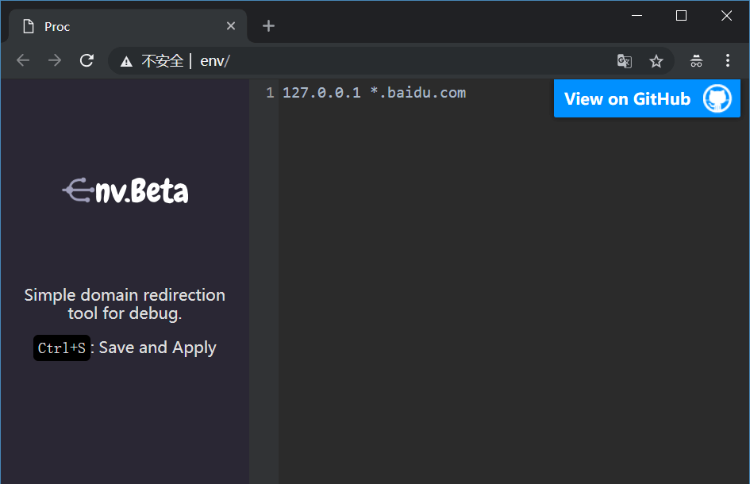

# Env.Beta

Simple domain redirection tool for debug.

# Config

1. Exec command and open new tabs with urls `http://env/`.
2. Add new rules in Right textarea.
3. Type `Ctrl+S` for save and apply change in Proxy.
4. Now, do anythins for check the rule.

# Rules

* Like hosts in MacOS, U can point multi domains to same IP. `127.0.0.1 domain.a, domain.b`
* Wildcards are also supported. `127.0.0.1 *.example.com` can redirect all subdomain under example.com to 127.0.0.1
* emmmm...this all
